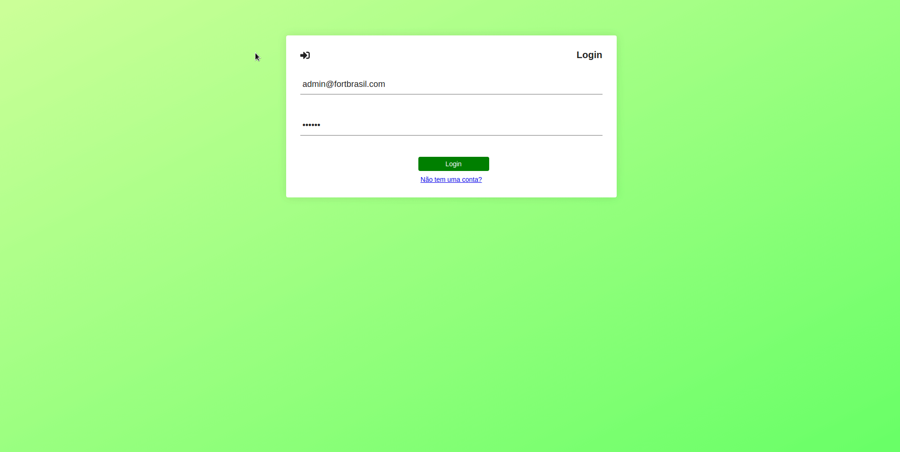

<h1 align="center">
  
  <br>
  Ajudando pessoas a viverem melhor
</h1>

<p align="center">
  &nbsp;&nbsp;&nbsp;&nbsp;
  
</a>

<p align="center">
  <a href="#rocket-sobre">Sobre</a>&nbsp;&nbsp;&nbsp;|&nbsp;&nbsp;&nbsp;
  <a href="#camera-preview">Preview</a>&nbsp;&nbsp;&nbsp;|&nbsp;&nbsp;&nbsp;
  <a href="#computer-como-usar">Como usar</a>&nbsp;&nbsp;&nbsp;
</p>

## :rocket: Sobre
Este projeto de um teste pratico para um gerenciamento de lojas mais proximas do cliente.

Esta é a 2/3 partes de um projeto como todo. O mesmo foi construído utilizando as tecnlologias mais populares de JavaScript e do mercado.

Se você ainda não baixou as partes (1/3) ou (3/3), você vai encontrar elas abaixo, siga os passos para uma instalação correta:
- [(1/3) Api](https://github.com/Demontie/api-fortbrasil)
- [(3/3) App](https://github.com/Demontie/fortbrasil-mobile)

## :camera: Preview



## :computer: Como usar
### Instalação na maquina local

```bash
# Clonar repositório
$ git clone https://github.com/Demontie/fortbrasil-frontend.git

# Pasta do clone
$ cd fortbrasil-frontend

# Instalar dependências
$ yarn install

# Execute a aplicação
$ yarn start
```

### Instalação utilizando [docker](https://www.docker.com/).

```bash
# Clonar repositório
$ git clone https://github.com/Demontie/fortbrasil-frontend.git

# Pasta do clone
$ cd fortbrasil-frontend

# Crie o arquivo .env com base no modelo .env.example é importante preencher o .env corretamente.
$ cp .env.example .env

# Subir a aplicação
$ docker-compose up -d
```
